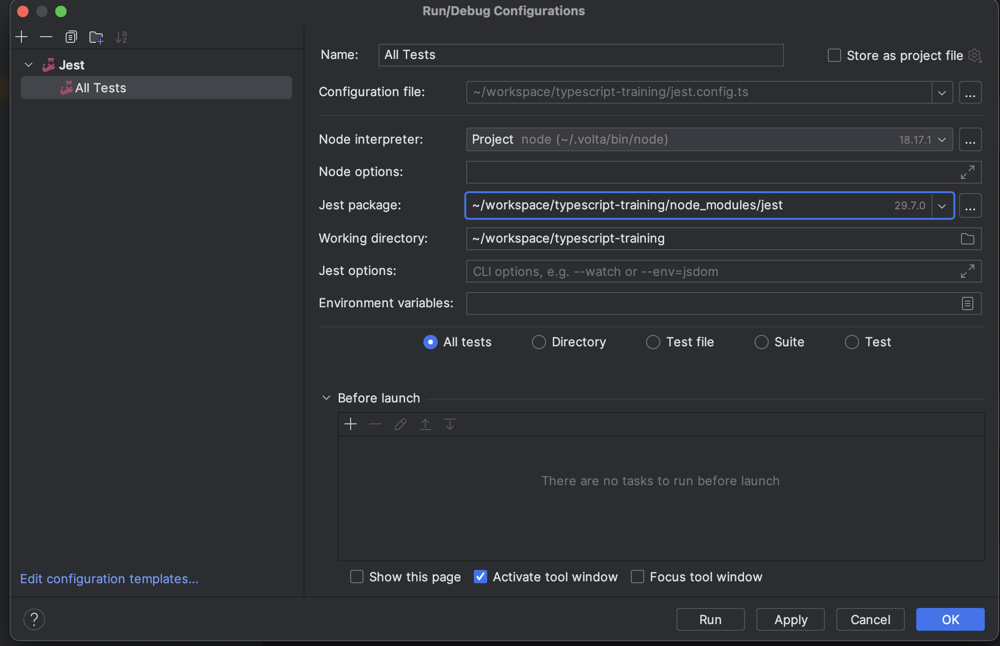

# Install

Execute the following commands

```
npm i
```

# Running test

The test run with jest.

## Run all test

```
npm test
```

## Run specific files

```
npm test nameFiles

ie: npm test about-classes.spec.ts
```

## Config IntellIj for jest


